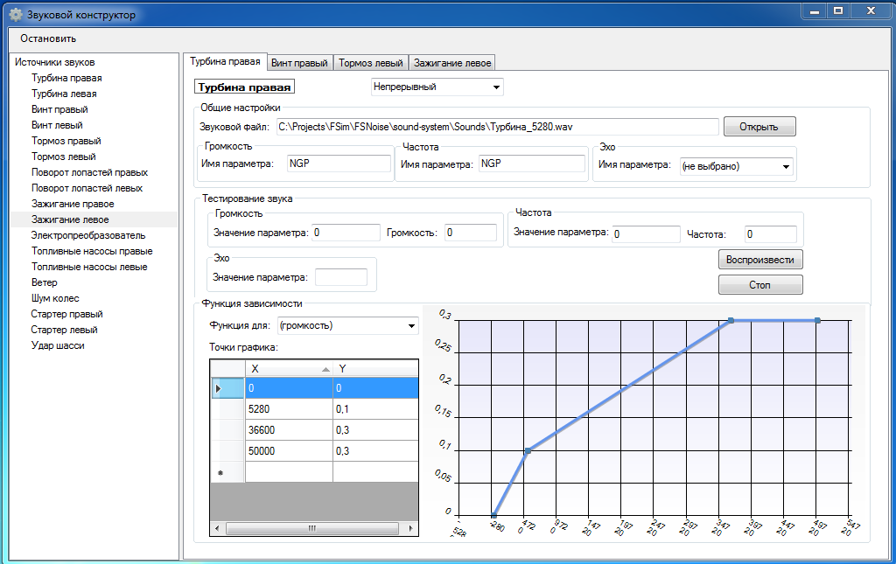
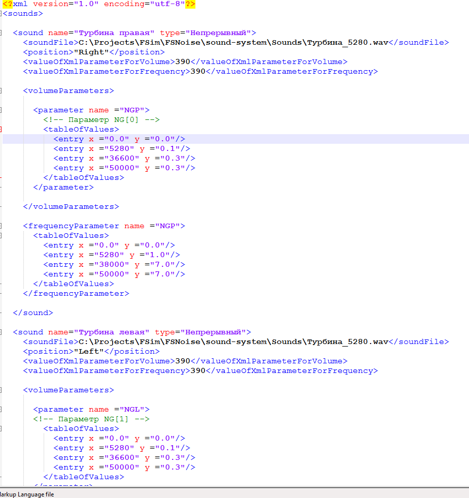

# Flight simulator sound system and constructor

The project is sound system of flight simulator with special constructor that allows to create sounds' generators using real sounds samples and adust the sounds, based on subject evaluations. The sounds' configuration is stored in XML-fie. The application obtain parameters of simulated sounds sources from network over UDP protocol. 

Sound constructor GUI:

XML-model of sound system:

